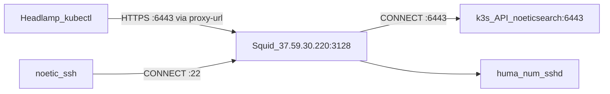
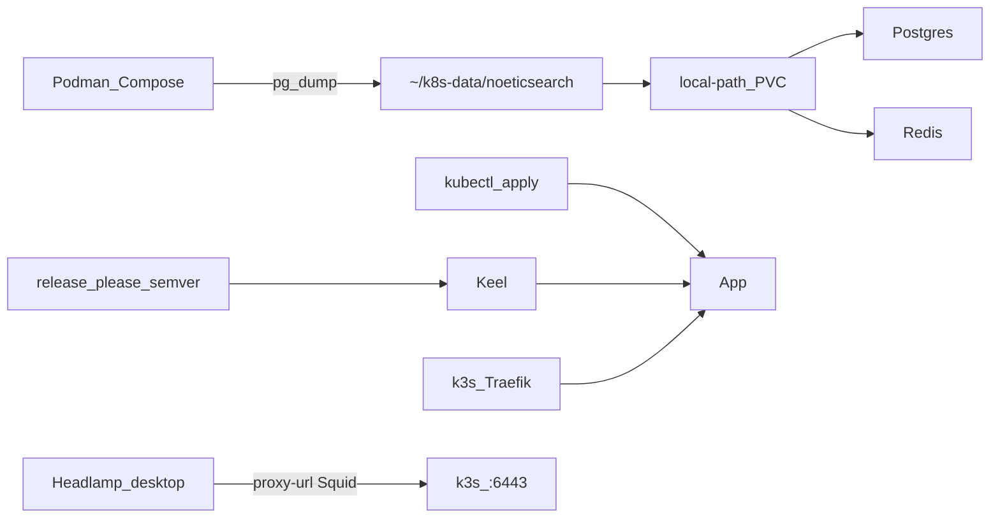

# Migrate NoeticSearch → k3s + Keel (same host)

Same-host migrate on `noeticsearch.huma-num.fr` via **`noetic-ssh`**: Podman/Arcane → k3s + Keel, local Headlamp/kubectl via kubeconfig **`proxy-url`** through Squid (`37.59.30.220:3128`) to `https://noeticsearch.huma-num.fr:6443`, then remove Arcane/Podman. No Terraform, no Flux, no LaunchAgent/SSH tunnel for Headlamp.

## Execution access (required)

Ops shells still use **`noetic-ssh`**. Headlamp and local kubectl use Squid as kubeconfig `proxy-url` — no SSH session required.

```bash
# ~/.zshrc
alias noetic-ssh='ssh noetic'
```

```sshconfig
# ~/.ssh/config (already configured) — shells / one-shot ops only
Host noetic
  HostName noeticsearch.huma-num.fr
  User yvenaomar
  LocalForward 3552 localhost:3552
  ProxyCommand /Users/younes/.ssh/digitalanimalities-proxy-command.py %h %p

Host noetic-ssh
  HostName noeticsearch.huma-num.fr
  User yvenaomar
  LocalForward 3552 localhost:3552
  ProxyCommand /Users/younes/.ssh/digitalanimalities-proxy-command.py %h %p
```

How access layers stack:



| Use | How |
| --- | --- |
| Interactive shell | `noetic-ssh` (or `ssh noetic`) |
| One-shot remote command | `noetic-ssh '…'` |
| kubectl **on host** | `noetic-ssh 'sudo k3s kubectl …'` |
| Headlamp / local kubectl | kubeconfig `server: https://noeticsearch.huma-num.fr:6443` + `proxy-url` → Squid (credentials in gitignored file only) |

**Chosen Headlamp path:** kubectl/Headlamp-native `proxy-url` (HTTP CONNECT). No autossh, no LaunchAgent, no LocalForward of 6443.

Manifests are authored in this repo; **install, apply, migrate, verify, and cleanup run only on the host reached by `noetic-ssh`.**

---

## Discovery

### Host

| Item | Value |
| ---- | ----- |
| Host | `noeticsearch.huma-num.fr` |
| User | `yvenaomar` (uid 1001, sudo) |
| Runtime today | Rootless Podman |
| k3s | Not installed yet |
| Disk | ~79 GiB free |
| Ports 80/443 | Rootless Traefik (`rootlessport`) |
| Squid | `37.59.30.220:3128` (HTTP CONNECT; user `proxy`; password only in gitignored kubeconfig) |

### Arcane ([arcane.0xzen.dev](https://arcane.0xzen.dev))

Environment **`noeticsearch`** (`e832e365-b6fd-47d6-839f-5bb7145b3629`).

| In-container | Host path |
| ------------ | --------- |
| `/app/data` | `…/volumes/arcane_arcane-data/_data` |
| Project | `…/projects/noeticsearch-stack` |
| Agent compose | `/home/yvenaomar/arcane` |

### Durable data ([archive/stack.yml](../archive/stack.yml))

```
…/projects/noeticsearch-stack/data/
  postgres/     ~124 MiB (DB ~37 MiB)
  redis/        ~28 KiB
  letsencrypt/  (replaced by k3s Traefik ACME)
```

Prefer **`pg_dump`** for postgres migration.



---

## Scope

| Layer | Choice |
| ----- | ------ |
| Node | Install k3s on Huma-Num via `noetic-ssh` |
| GitOps | `kubectl apply -k infra/` |
| Image updates | Keel semver (`major` + poll), not `:latest` |
| Releases | release-please → GHCR semver tags |
| Monitoring | Local Headlamp; kubeconfig `proxy-url` via Squid to `:6443` |
| After cutover | Fully remove Arcane + Podman |

---

## Target layout

**Data dirs (default):**

```
/home/yvenaomar/k8s-data/noeticsearch/
  postgres/
  redis/
```

Use k3s `local-path` StorageClass (or hostPath PVs pointing at those dirs).

**Namespace:** `noeticsearch`

**Repo:**

```
infra/
  kustomization.yaml
  namespace.yaml
  postgres/
  redis/
  app/
  adminer/
  ingress/
  keel/
  secrets.yml              # gitignored
  secrets.example.yml
  kubeconfig.example.yaml  # placeholder proxy-url, no password
  kubeconfig.local.yaml    # gitignored — real Squid creds + SA token
docs/
  k3s-keel-migration.md    # this plan
```

---

## Tracking checklist

- [x] Phase 0: `pg_dump` from `noeticsearch-stack-postgres-1`
- [x] Phase 0: finalize `infra/secrets.yml` (+ keep `secrets.example.yml` in sync)
- [x] Phase 0: Squid does **not** allow CONNECT :6443 — Headlamp uses SSH LocalForward (`https://127.0.0.1:6443`)
- [x] Phase 0: plan downtime to free ports 80/443
- [x] Phase 1: stop Compose Traefik/stack
- [x] Phase 1: install k3s with `--tls-san noeticsearch.huma-num.fr`
- [x] Phase 1: firewall `:6443` from Squid `37.59.30.220` only
- [x] Phase 1: create `~/k8s-data/noeticsearch/{postgres,redis}`
- [x] Phase 2: install Keel; wire app labels (`major` + poll)
- [x] Phase 2b: create `headlamp-admin` SA + token
- [x] Phase 2b: write `kubeconfig.local.yaml` (Squid `proxy-url` + tunnel context)
- [x] Phase 2b: verify kubectl/Headlamp via **SSH LocalForward** (Squid CONNECT:6443 still 403)
- [x] Phase 3: author `infra/` kustomize manifests
- [x] Phase 3: apply on host via `noetic-ssh` kubectl
- [x] Phase 4: restore DB; verify HTTPS/auth/search
- [x] Phase 4: soak with Podman stopped; confirm Keel
- [x] Phase 5: remove Arcane + Podman; archive compose files

---

## Phase 0 — Prep (`noetic-ssh`)

1. `pg_dump` from `noeticsearch-stack-postgres-1`.
2. Secrets: gitignored [`infra/secrets.yml`](../infra/secrets.yml) (from production `.env`). Template: [`infra/secrets.example.yml`](../infra/secrets.example.yml).
3. Downtime: free ports 80/443 before k3s Traefik.
4. Confirm Squid allows **HTTP CONNECT to port 6443** (not only 22). If CONNECT to 6443 is denied, open that ACL on the Squid host before Headlamp will work.

## Phase 1 — Install k3s (`noetic-ssh`)

1. Stop Compose Traefik / stack to free 80/443.
2. Install with TLS SAN for the **public hostname** (Headlamp hits the real API URL through Squid):

```bash
noetic-ssh 'curl -sfL https://get.k3s.io | sudo sh -s - \
  --write-kubeconfig-mode 644 \
  --tls-san noeticsearch.huma-num.fr \
  --tls-san 127.0.0.1 \
  --tls-san localhost'
```

3. **Firewall `:6443`:** allow TCP **only from Squid** `37.59.30.220` (and localhost). Do **not** open `:6443` to the whole internet.

```bash
# example — adapt to host firewall (ufw/nftables/cloud ACL)
# allow 37.59.30.220 → host:6443
# deny everyone else → :6443
```

4. Copy CA + create SA token for Phase 2b.

## Phase 2 — Keel (`noetic-ssh`)

```yaml
labels:
  keel.sh/policy: major
  keel.sh/trigger: poll
annotations:
  keel.sh/pollSchedule: "@every 5m"
# image: ghcr.io/celluloid-camp/noeticsearch:0.1.4
```

## Phase 2b — Headlamp via kubeconfig `proxy-url` (Squid)

**Chosen approach:** Headlamp/kubectl use Squid directly — no SSH tunnel, no LaunchAgent.

1. Create SA + token on the host:

```bash
noetic-ssh 'sudo k3s kubectl -n kube-system create serviceaccount headlamp-admin'
noetic-ssh 'sudo k3s kubectl create clusterrolebinding headlamp-admin \
  --clusterrole=cluster-admin --serviceaccount=kube-system:headlamp-admin'
# mint long-lived token (k3s/k8s version-appropriate)
```

2. Write **gitignored** [`infra/kubeconfig.local.yaml`](../infra/kubeconfig.local.yaml) (password never committed):

```yaml
apiVersion: v1
kind: Config
clusters:
  - name: noeticsearch-huma-num
    cluster:
      server: https://noeticsearch.huma-num.fr:6443
      proxy-url: http://proxy:<SQUID_PASSWORD>@37.59.30.220:3128
      certificate-authority-data: <base64 CA>
      # or temporarily: insecure-skip-tls-verify: true
contexts:
  - name: noeticsearch-huma-num
    context:
      cluster: noeticsearch-huma-num
      user: headlamp-admin
current-context: noeticsearch-huma-num
users:
  - name: headlamp-admin
    user:
      token: <SA token>
```

Committed template [`infra/kubeconfig.example.yaml`](../infra/kubeconfig.example.yaml) uses a password placeholder only.

3. Point Headlamp / kubectl at that file:

```bash
export KUBECONFIG="$PWD/infra/kubeconfig.local.yaml"
kubectl get nodes
# Open Headlamp desktop with the same kubeconfig — no SSH window
```

4. Smoke-test CONNECT path (optional):

```bash
curl -x 'http://proxy:<SQUID_PASSWORD>@37.59.30.220:3128' \
  -vk https://noeticsearch.huma-num.fr:6443/version
```

**Not chosen:**

| Approach | Why not |
| -------- | ------- |
| autossh / macOS LaunchAgent | User rejected; not kubeconfig-native |
| kubeconfig `ssh://` | Unsupported |
| In-cluster Headlamp + Ingress | Not needed if Squid `proxy-url` works |
| Public open `:6443` | Too broad; restrict to Squid IP |

Ops shells still use `noetic-ssh` as usual.

## Phase 3 — Manifests (local author, `noetic-ssh` apply)

Apply with `noetic-ssh 'sudo k3s kubectl apply -k …'`. Include app (Keel labels), postgres, redis, adminer, Ingress for `noeticsearch.huma-num.fr`, and `infra/secrets.yml`.

## Phase 4 — Restore + cutover (`noetic-ssh`)

1. Restore `pg_dump` into k8s Postgres.
2. Verify HTTPS / auth / search.
3. Soak with Podman stopped but not deleted.
4. Confirm Keel.

## Phase 5 — Clean Arcane and Podman (`noetic-ssh`)

Only after k3s is verified.

1. Stop/rm `noeticsearch-stack-*` containers.
2. Tear down `~/arcane` edge agent; disable env on arcane.0xzen.dev.
3. Remove `arcane_arcane-data` volume (after off-box dump backup).
4. `podman container/image/volume prune` as appropriate.
5. Disable unused `podman-restart.service` / `podman.socket`.
6. Archive [`archive/stack.yml`](../archive/stack.yml) when k8s is sole path (done).

---

## What not to do

- Do not run ops on any host other than **`noetic-ssh`** / `yvenaomar@noeticsearch.huma-num.fr`.
- Do not use digitalanimalities as the k3s **install** target (Squid is the HTTP proxy only).
- Do not run Podman Traefik and k3s Traefik on the same ports.
- Do not use Keel `:latest` / `force`.
- Do not open `:6443` to the whole internet — allow Squid `37.59.30.220` only.
- Do not commit Squid password, `infra/secrets.yml`, or `infra/kubeconfig.local.yaml`.
- Do not delete Arcane volume until restore is verified.
- Do not rely on LaunchAgent/autossh for Headlamp.

---

## Success criteria

- k3s healthy on `noeticsearch.huma-num.fr`.
- App at `https://noeticsearch.huma-num.fr` via k3s Traefik.
- DB restored; Keel tracks release-please semver tags.
- Headlamp/kubectl work with kubeconfig `proxy-url` through Squid (no SSH tunnel).
- `:6443` reachable from Squid only.
- Arcane/Podman stack and volumes removed; 80/443 owned by k3s only.
